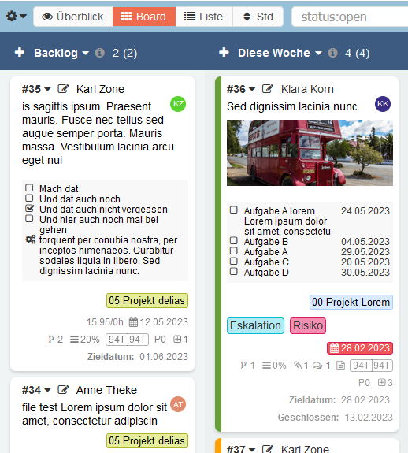

 Use the table of contents icon

  

**:star: If you use it, you should star it on GitHub!** *It's the least you can do for all the work put into it!*

# Show Subtasks on Board

Displays the subtasks of a task on the task card on the board. One can change state of a subtask directly on the card. Supports display of [subtask due date](https://github.com/eSkiSo/Subtaskdate) if that plugin is installed.

## Features

- Set the status of a subtask directly on the card (not yet started, in progress, finished)

- display due date of the sub task (needs the subtask due date plugin s. above)

- Tested with [ThemeMaestro](https://github.com/JustFxDev/ThemeMaestro)

## Screenshots

Requirements
------------

- Kanboard >= 1.2.20

## Installation

Options for the installation:

1. Installation via the plugin manager in Kanboard (recommended).
2. Download the zip file from releases folder here in the repository and unzip it in the directory `plugins/SubtasksOnBoard` (recommended)
3. Clone the repository (current master) into the directory `plugins/SubtasksOnBoard` (not recommended. Very latest code, but not yet released code)

Note: All names in the plugin directory are case-sensitive

## Possible further development

- Provide configuration option to enable or disable the display of subtasks on cards per board

## Authors & Contributors
- [JustFxDev](https://github.com/JustFxDev/) - Author (since v1.0.9)
- [rfde](https://github.com/rfde) - Author (until v1.0.0)
- _Contributors welcome_

## License
- This project is distributed under the [MIT License](../main/LICENSE "Read The MIT license")
